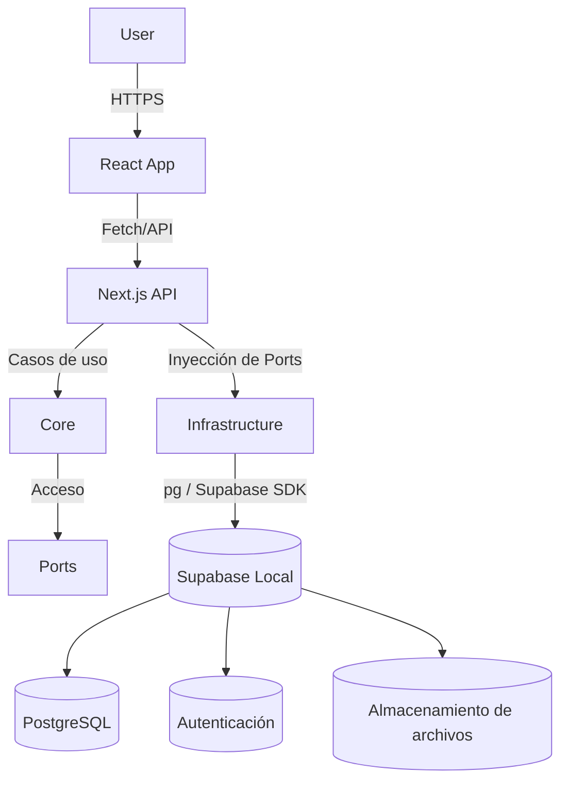

# 🏗 Arquitectura de Khipu

**Khipu** es una aplicación web autoalojada para instituciones educativas, orientada a organizar, generar y almacenar documentación institucional mediante una interfaz tipo dashboard con módulos y plugins.

Este documento describe la arquitectura actual del sistema, los componentes principales, el diseño de carpetas, el flujo de trabajo y las decisiones clave.

---

## 🧭 Visión general

Khipu está compuesto por tres capas principales:

- 🧑‍🏫 **Frontend Web**: SPA desarrollada en React (v18.3.7).
- ⚙️ **API Backend**: Next.js (v15.2.4) con rutas App Router y arquitectura hexagonal.
- 🗄️ **Supabase Local**: Contenedor independiente que gestiona:
  - Base de datos PostgreSQL
  - Autenticación de usuarios
  - Almacenamiento de archivos

---

## 🧩 Diagrama general de arquitectura

